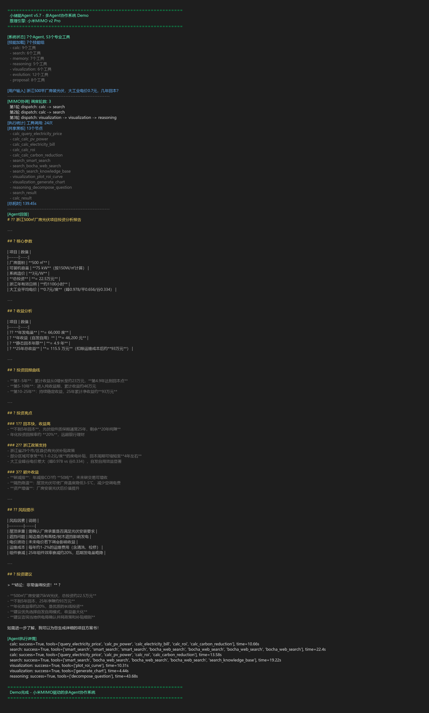

# 小储能Agent v5.7 - 储能光伏行业垂直多智能体系统

基于小米MIMO大模型驱动的多Agent协作系统，面向储能/光伏行业提供智能分析和方案生成服务。

## 系统架构

```
Orchestrator (动态协调者)
├── CalcAgent       (计算专家 - 9个行业工具)
├── SearchAgent     (搜索专家 - 6个搜索工具)
├── MemoryAgent     (记忆管家 - 7个记忆工具)
├── ReasoningAgent  (分析专家 - 5个推理工具)
├── VisualizationAgent (图表专家 - 6个可视化工具)
├── EvolutionAgent  (进化引擎 - 12个自学习工具)
└── ProposalAgent   (方案专家 - 8个方案工具)
```

## 核心特性

- **多Agent动态协调**: Orchestrator根据中间结果动态调整执行计划
- **共享黑板**: Agent间通过共享黑板交换计算结果
- **Agent间通信**: Agent可主动调用其他专家Agent求助
- **持久化记忆**: 每个Agent跨对话积累行业经验
- **自进化机制**: 自动学习失败案例，生成技能补丁热更新
- **53个行业工具**: 覆盖电价查询、投资回报、碳减排、方案生成等

## 实测Demo



### 测试场景: 浙江500平厂房装光伏几年回本？

- MIMO调度3轮，涉及7个Agent
- 调用24个行业工具
- 共享黑板产生13个节点
- 输出完整的投资分析报告（装机容量、回本周期、碳减排、投资回报曲线）

## 技术栈

- 推理引擎: 小米MIMO v2 Pro
- Agent框架: 自研多Agent协调系统
- 知识库: ChromaDB + BGE中文嵌入
- 行业工具: 53个专业工具（电价数据库、光伏参数库、碳排放因子库）
